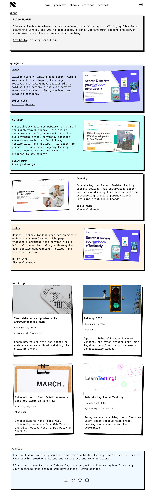

# My Personal Website

  

Welcome to my personal website project! This website serves as a platform to showcase information about me, my open-source projects, writings, ebooks, and contact information.

## Design Mockup

This website follows the **Neo-Brutalism** design style, emphasizing bold, vibrant colors, sharp contrasts, and raw aesthetics.

For the design mockup of this website, you can view it on Figma:
[View Figma Mockup](https://www.figma.com/file/cKOboscKKBYe3G0LIqWCZ9/Bearmentor-Project?type=design&node-id=0-1&mode=design&t=xX9Cy45IbV91dzyw-0)

## Features

- **Home:** Provides an overview about me.
- **Projects:** Lists my open-source projects, along with the technologies used and demo links.
- **Writing:** Features my writings.
- **Ebooks:** Lists my ebooks.
- **Contact:** Provides links to my social media profiles for contacting me.

## Technologies Used

- HTML5
- Tailwind CSS

## Preview

## Contributing

Contributions are welcome! Feel free to open issues or pull requests for any improvements.
## License

This project is licensed under the [MIT License](LICENSE).
